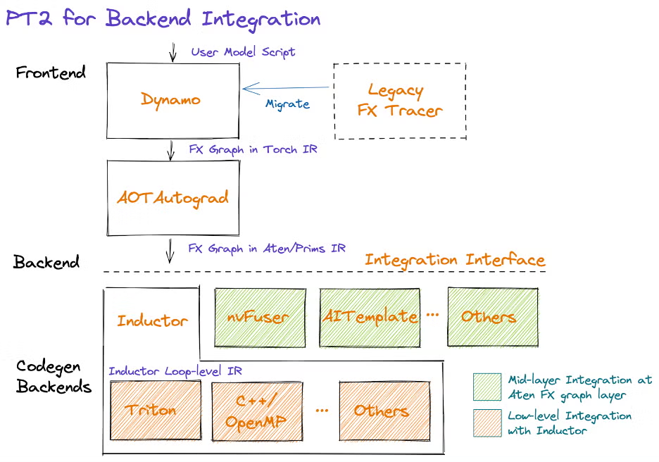
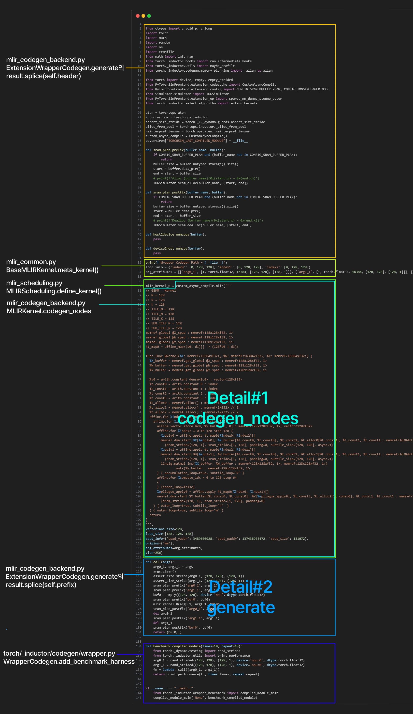
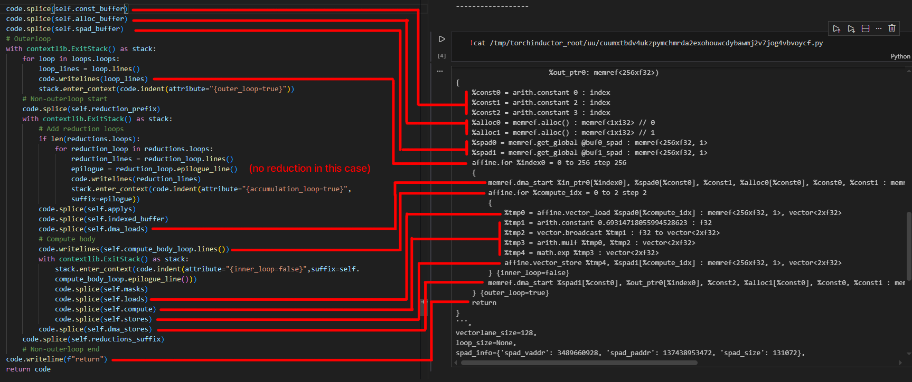

# PyTorchSim 분석: torch code → MLIR




https://pytorch.org/get-started/pytorch-2-x/

컴파일 없이 그냥 실행하면 한줄씩 하므로 느리다. torch.compile을 분석해 보자

# I. torch Code → Loop-Level IR


### 0. torch.compile 실행

```python
opt_fn = torch.compile(dynamic=False)(exponent2)
res = opt_fn(x)
```

```python
# torch/__init__.py
def compile(..., backend: Union[str, Callable] = "inductor",...):
	...
	if backend == "inductor":
        backend = _TorchCompileInductorWrapper(mode, options, dynamic)
  ...
	return torch._dynamo.**optimize**(backend=backend, nopython=fullgraph, dynamic=dynamic, disable=disable)(model)
```

`res = torch._dynamo.optimize(...)(x)`  

### 1. optimize

```python
# torch/_dynamo/eval_frame.py
def optimize(...):
	...
	backend = **get_compiler_fn**(backend)
	backend_ctx_ctor = getattr(backend, "backend_ctx_ctor", null_context)
	...
  return _optimize_catch_errors(
	    **convert_frame.convert_frame**(backend, hooks=hooks),
	    hooks,
	    backend_ctx_ctor,
	    dynamic=dynamic,
	    save_config=save_config,
	    compiler_config=backend.get_compiler_config()
	    if hasattr(backend, "get_compiler_config")
	    else None,
	)
```

`res = _optimize_catch_errors(...)(x)`  

- backend가 뭔지 알기 위해 `get_compiler_fn` 과
- 다음으로 `convert_frame`을 살펴보자.

### 2.1 get_compiler_fn

```python
# torch/_dynamo/eval_frame.py
def get_compiler_fn(compiler_fn):
    from .repro.after_dynamo import wrap_backend_debug

    if hasattr(compiler_fn, "compiler_name"):
        compiler_str = compiler_fn.compiler_name
    elif isinstance(compiler_fn, str):
        compiler_str = compiler_fn
    else:
        compiler_str = None
    compiler_fn = lookup_backend(compiler_fn)
    return **wrap_backend_debug**(compiler_fn, compiler_str)
```

```python
# torch/_dynamo/repro/after_dynamo.py
def wrap_backend_debug(unconfigured_compiler_fn, compiler_name: str):
    ...
            compiled_gm = **compiler_fn**(gm, example_inputs)
        return compiled_gm
        
    debug_wrapper._torchdynamo_orig_callable = unconfigured_compiler_fn  # type: ignore[attr-defined]
    if hasattr(unconfigured_compiler_fn, "compiler_name"):
        debug_wrapper.__name__ = unconfigured_compiler_fn.compiler_name
    if hasattr(unconfigured_compiler_fn, "get_compiler_config"):
        debug_wrapper.get_compiler_config = unconfigured_compiler_fn.get_compiler_config  # type: ignore[attr-defined]
    return debug_wrapper
```

`backend = get_compiler_fn(backend)` 에서 `backend`는 다음과 같다.

- `(gm, example_inputs)` 을 받아서 `_TorchCompileInductorWrapper(gm, example_inputs)`을 실행하는 함수에 몇가지 정보가 붙은 것
- Note: `torch/_dynamo_backends` 를 보면 그걸 CompilerFn이라고 한다.
    
    ```python
    # torch/_dynamo/backends/registry.py
    class CompiledFn(Protocol):
        def __call__(self, *args: torch.Tensor) -> Tuple[torch.Tensor, ...]:
            ...
    
    CompilerFn = Callable[[fx.GraphModule, List[torch.Tensor]], CompiledFn]
    ```
    

### 2.2 convert_frame(backend, hooks=hooks)

```python
# torch/_dynamo/convert_frame.py
def convert_frame(compiler_fn: CompilerFn, hooks: Hooks):
    """Try to convert a frame into an FX graph, if error leave frame unmodified"""
    inner_convert = **convert_frame_assert**(compiler_fn, one_graph=False)

    def _convert_frame(frame: types.FrameType, cache_entry, hooks: Hooks, frame_state):
        counters["frames"]["total"] += 1
        try:
            result = inner_convert(frame, cache_entry, hooks, frame_state)
            counters["frames"]["ok"] += 1
            return **result**
        ...

    _convert_frame._torchdynamo_orig_callable = compiler_fn  # type: ignore[attr-defined]
    _convert_frame._clone_with_backend = lambda backend: convert_frame(backend, hooks)  # type: ignore[attr-defined]
    return _convert_frame
```

- 주석에도 나와 있듯이 Convert a frame into an FX graph를 담당하는 부분이다.

```python
# torch/_dynamo/convert_frame.py
def convert_frame_assert(
    compiler_fn: CompilerFn,
    one_graph: bool = True,
    ...
):
    """Fully convert a frame into an FX graph"""
    reset_graph_break_dup_checker()

    def _convert_frame_assert(
        frame: types.FrameType, cache_entry, hooks: Hooks, frame_state
    ):
        ...
        with config.patch(_patch_config_if_changed()):
            compiled_product = **_compile**(
                ...
                **compiler_fn**,
                ...
            )
        return compiled_product

    _convert_frame_assert._torchdynamo_orig_callable = compiler_fn  # type: ignore[attr-defined]

    def _clone_with_backend(backend):
        return convert_frame_assert(backend, one_graph, export, export_constraints)

    _convert_frame_assert._clone_with_backend = _clone_with_backend  # type: ignore[attr-defined]
    return _convert_frame_assert
```

- 반환하는 값: `frame, cache_entry, hooks, frame_state` 를 받아서 `_compile` 를 반환하는 함수.
- Note: torch/_dynamo/types.py를 보면 DynamoCallback이라고 부른다.
    
    ```python
    # torch/_dynamo/types.py
    class DynamoCallbackFn(Protocol):
        def __call__(
            self,
            frame: DynamoFrameType,
            cache_entry: Optional[CacheEntry],
            frame_state: FrameState,
        ) -> Optional[GuardedCode]:
            ...
    
    DynamoCallback = Union[DynamoCallbackFn, None, bool]
    ```
    
- 내부의 _compile을 살펴보자.

### 3. _compile (torch code → FX Graph)

현재 호출되는 상황에서의 `compiler_fn` 인자는 `_TorchCompileInductorWrapper(gm, example_inputs)` 이다.

```python
# torch/_dynamo/convert_frame.py
@maybe_cprofile
def _compile(
    ...
    compiler_fn: CompilerFn,
    ...
) -> Optional[GuardedCode]:
    ...

    @preserve_global_state
    def transform(instructions, code_options):
        nonlocal output
        speculation_log.restart()
        tracer = **InstructionTranslator**(
            ...
            **compiler_fn**,
            ...
        )

        try:
            with tracing(tracer.output.tracing_context), tracer.set_current_tx():
                tracer.run()
        ...

        output = tracer.output
        assert output is not None
        assert output.output_instructions
        instructions[:] = output.output_instructions
        code_options.update(output.code_options)
        ...
    @dynamo_timed(phase_name="entire_frame_compile")
    def compile_inner(
        code: types.CodeType,
        one_graph: bool,
        hooks: Hooks,
        transform: Callable[[List[Instruction], Dict[str, Any]], Any],
    ) -> Optional[GuardedCode]:
        nonlocal output
        for attempt in itertools.count():
            CompileContext.get().attempt = attempt
            try:
                out_code = **transform_code_object**(code, **transform**)
                break
            ...
        guarded_code = GuardedCode(out_code, check_fn.check_fn)

        ...
        return guarded_code

    with compile_context(CompileContext(compile_id)):
        try:
            guarded_code = compile_inner(code, one_graph, hooks, **transform**)
            return guarded_code
        ...
```

1. `_compile`의 반환값은 `guarded_code`이다.
2. `guarded_code = **compile_inner**(code, one_graph, hooks, **transform**)`이다.
3. `compile_inner`에서는 **`transform_code_object**(code, **transform**)`가 실행된다.
    
    ```python
    # torch/_dynamo/bytecode_transformation.py
    def transform_code_object(code, transformations, safe=False) -> types.CodeType:
        keys = get_code_keys()
        code_options = {k: getattr(code, k) for k in keys}
        assert len(code_options["co_varnames"]) == code_options["co_nlocals"]
    
        instructions = cleaned_instructions(code, safe)
        propagate_line_nums(instructions)
    
        **transformations**(instructions, code_options)
        return clean_and_assemble_instructions(instructions, keys, code_options)[1]
    ```
    
    - `transform`은 함수였고, “실행” 되었다.
- `transform` 내부를 다시 보면 다음과 같다.

```python
# torch/_dynamo/convert_frame.py
tracer = **InstructionTranslator**(
    ...
    **compiler_fn**,
    ...
)

try:
    with tracing(tracer.output.tracing_context), tracer.set_current_tx():
        **tracer.run()**
output = tracer.output
assert output is not None
assert output.output_instructions
instructions[:] = output.output_instructions
code_options.update(output.code_options)
```

- `InstructionTranslator` 객체의 `.run()`을 호출한다.

```python
# torch/_dynamo/symbolic_convert.py
class InstructionTranslator(InstructionTranslatorBase):
		def __init__(
				super().__init__(
            output=**OutputGraph**(
                ...
            ),
            instructions=instructions,
            ...
        )
		def run(self):
        super().**run**()
```

무언가 일어나고 있다.

먼저 run을 살펴보자.

### 4. InstructionTranslatorBase.run()

```python
# torch/_dynamo/symbolic_convert.py
class InstructionTranslatorBase(Checkpointable[InstructionTranslatorGraphState]):
    def run(self):
        ...
                while (
                    self.instruction_pointer is not None
                    and not self.output.should_exit
                    and **self.step()**
                ):
                    pass
            ...
            
    def step(self):
        """Process exactly one instruction, return False we should exit"""
        assert isinstance(self.instruction_pointer, int)
        inst = self.instructions[self.instruction_pointer]
        self.current_instruction = inst
        ...
        try:
            ...
            **getattr(self, inst.opname)(inst)**

            return inst.opname != "RETURN_VALUE"
        ...
```

- 한 inst씩 opcode에 대응되는 메소드를 호출하게 된다.

### 4.1 RETURN_VALUE

```python
# torch/_dynamo/symbolic_convert.py
class InstructionTranslatorBase(Checkpointable[InstructionTranslatorGraphState]):
		def RETURN_VALUE(self, inst):
        if (
            self.output.count_calls() == 0
            and not self.inconsistent_side_effects
            and not self.symbolic_locals_contain_module_class()
            and not self.export
        ):
            raise exc.SkipFrame("because no content in function call")
        self.instruction_pointer = None
        _step_logger()(
            logging.INFO,
            f"torchdynamo done tracing {self.f_code.co_name} (RETURN_VALUE)",
        )
        **log.debug("RETURN_VALUE triggered compile")**
        self.output.**compile_subgraph**(
            self,
            reason=GraphCompileReason(
                "return_value", [self.frame_summary()], graph_break=False
            ),
            compile_return_value=True,
        )
        self.output.add_output_instructions([create_instruction("RETURN_VALUE")])
```

- `getattr(self, inst.opname)(inst)` 에서 return이 나오면 실행되는 코드이다.
- 즉 **FX Graph를 다 만들었고**, 이제 Machine Code Backend로 보낼 준비가 되었다는 것이다.
    - 우리는 MLIR을 만드는 커스텀 inductor 기반 backend로 갈 것이다.
- `compile_subgraph`를 호출한다. 살펴보자

### 5. OutputGraph

```python
# torch/_dynamo/output_graph.py
class OutputGraph(Checkpointable[OutputGraphState]):
    """
    Wrapper class to hold outputs of InstructionTranslator.  Mainly the
    generated fx.Graph.

    OutputGraph is 1:1 with a frame being processed. Each frame is associated
    with some root InstructionTranslator. When user code calls a function,
    we construct a InliningInstructionTranslator that continues to write into
    the root InstructionTranslator's OutputGraph.
    """
    def **compile_subgraph**(...):
        """
        Generate a subgraph to continue execution on user code.
        Automatically restore live variables.
        """
		        self.add_output_instructions(
                self.**compile_and_call_fx_graph**(tx, list(reversed(stack_values)), root)
                + [create_instruction("UNPACK_SEQUENCE", arg=len(stack_values))]
            )
        
    def **compile_and_call_fx_graph**(self, tx, rv, root):
        """
        Generate code from self.graph and return the Instruction()s to
        call that generated code.
        """
        ...
		    with self.restore_global_state():
            compiled_fn = self.**call_user_compiler**(gm)
        ...
            
    @dynamo_timed(phase_name="backend_compile")
    def call_user_compiler(self, gm: fx.GraphModule) -> CompiledFn:
        ...
        for node in gm.graph.nodes:
            if node.op in ("call_function", "call_method", "call_module"):
                tot += 1
            if node.op == "placeholder":
                placeholders.append(node)
		        ...
            compiled_fn = **compiler_fn(gm, self.example_inputs())**
            _step_logger()(logging.INFO, f"done compiler function {name}")
            assert callable(compiled_fn), "compiler_fn did not return callable"
        ...
        return compiled_fn
```

<aside>
💡

`compiler_fn`이 “호출” 되었다.

그리고 이 `compiler`은 `backend` (즉 `_TorchCompileInductorWrapper` 타입의 `inductor`)이고, 호출이 되면서 `__call__` 이 작동, Scheduler의`compile_fx`가 실행되어 MLIR로 바꾸는 코드에 진입하게 된다. (후술)

</aside>

```python
class _TorchCompileInductorWrapper:
    compiler_name = "inductor"

    ...

    def __call__(self, model_, inputs_):
        from torch._inductor.compile_fx import compile_fx

        return compile_fx(model_, inputs_, config_patches=self.config)
```

# II. Loop Level IR→ MLIR


### 만들어지는 코드



### 1. Scheduler

```python
# torch/_inductor/compile_fx.py        
def compile_fx(...,
    inner_compile: Callable[..., Any] = **compile_fx_inner**,...):
    ...
    (다양한 경우로 나뉘어서 inner_compile 담은 함수 반환)  
	
def compile_fx_inner(...):
	...
	compiled_graph = **fx_codegen_and_compile**(
    gm, example_inputs, **graph_kwargs  # type: ignore[arg-type]
  )
...
def fx_codegen_and_compile(...)
	...
	with V.set_graph_handler(graph):
    graph.**run**(*example_inputs)
		compiled_fn = graph.**compile_to_fn**()
```

- `graph.run`은 II-A.Actually Making MLIR에서 다룬다.
- compile_to_fn()을 살펴보자.

```python
# torch/_inductor/graph.py
class GraphLowering(torch.fx.Interpreter):
    def **compile_to_fn**(self):
        ...
            return self.**compile_to_module**().**call**
		...
		
		@dynamo_timed
    def **compile_to_module**(self):
        from .codecache import PyCodeCache

        code, linemap = (
            self.**codegen_with_cpp_wrapper()** if self.cpp_wrapper 
            else **self.codegen()**
        )
        linemap = [(line_no, node.stack_trace) for line_no, node in linemap]
        key, path = PyCodeCache.write(code)
        mod = PyCodeCache.load_by_key_path(
            key, path, linemap=linemap, attrs=self.constants
        )
        ...
        return mod
        
    def codegen_with_cpp_wrapper(self):
        ...
        if "cuda" in self.device_types:
            ...
        else:
            # cpu
            **return self.codegen()**
        
    def codegen(self):
        from .scheduler import Scheduler

        self.init_wrapper_code()

        self.scheduler = Scheduler(self.buffers)
        V.debug.draw_orig_fx_graph(self.orig_gm, self.scheduler.nodes)
        **self.scheduler.codegen()**
        return self.wrapper_code.generate(self.is_inference)
```

- 우리는 cpp가 아니므로 그냥 `codegen`이 실행될 것이고, `scheduler.codegen`이 실행된 다음 `generate`가 실행된다.
- `codegen`부터 살펴보자.

### 2. scheduler.codegen

```python
# torch/_inductor/scheduler.py
class Scheduler:
		...
		@dynamo_timed
    def codegen(self):
        for node in self.nodes:
            self.enter_context(node)
						...
						if node.is_template():
                node, *epilogue = node.get_nodes()
                self.codegen_template(node, epilogue)
            elif node.is_extern():
                self.codegen_extern_call(node)
            elif node.is_foreach():
                self.get_backend(device).codegen_foreach(node)
            elif isinstance(node, (FusedSchedulerNode, SchedulerNode)):
                self.get_backend(device).**codegen_nodes**(node.get_nodes())
```

1. `isInstance`: loop-level IR의 경우 → `codegen`
2. `is_template()`: template 코드의 경우 (CNN, GEMM 등) → `codegen` 
    1. IV. template 부분 참고
3. `is_extern()`: codegen 하는게 아니라 TOGSim으로 바로 실행.

- 이때 `get_backend(device)`를 하면, `def create_backend(self, device: torch.device):` 에서 `return device_scheduling(self)` 을 반환함. 따라서 디바이스 **`scheduler`의 `codegen_nodes`를 호출함.**
- 현재 Scheduler/scheduler.py에서 정의한 대로 `MLIRScheduling` 호출
    
    ```python
    register_backend_for_device(
        "npu", MLIRScheduling, ExtensionWrapperCodegen
    )
    ```
    

### 3. MLIRScheduling.codegen_nodes

커스텀 스케줄러 진입

```python
# PyTorchSim/PyTorchSimFrontend/mlir/mlir_scheduling.py
class MLIRScheduling(BaseScheduling):
    count = 0
    **target_kernel** = **MLIRKernel
    ...**
    def codegen_nodes(self, nodes):
		  _, (group, reduction_group) = max(
		      nodes, key=lambda x: int(x.is_reduction())
		  ).group
		  ...
		  **ex_kernel** = self.**target_kernel**(kernel_group=self.kernel_group)
		  ex_kernel.kernel_group = self.kernel_group
		
		  kernel_name_candidate = f"extension_kernel_{MLIRScheduling.count}"
		  MLIRScheduling.count += 1
		  src_code = **ex_kernel.codegen_nodes(nodes, kernel_name_candidate)**
		  kernel_name = self.**define_kernel**(src_code, kernel_name_candidate, ex_kernel.vector_lane,
		                     ex_kernel.spad_info, origins= {str(i) for i in nodes[0].node.origins})
		  ex_kernel.**call_kernel**(kernel_name)
```

3가지를 살펴보자.

1. kernel.codegen_nodes
2. define_kernel
3. call_kernel

### 4. kernel.codegen_nodes

```python
# PyTorchSim/PyTorchSimFrontend/mlir/mlir_codegen_backend.py
class MLIRKernel(mlir_common.BaseMLIRKernel):
    overrides = ExtensionOverrides
    ...
    def codegen_nodes(self, nodes, kernel_name):
        src_code = super().**codegen_nodes**(nodes, kernel_name)
        self._prepare_simulator_headers(src_code)
        if "autotune" in extension_config.codegen_mapping_strategy and extension_config.pytorchsim_timing_mode:
            optimal_src_code = self.autotune(nodes, kernel_name)[0]
            if optimal_src_code is not None:
                return optimal_src_code
        return src_code
```

```python
# PyTorchSim/PyTorchSimFrontend/mlir/mlir_common.py
class BaseMLIRKernel(common.Kernel, BaseMLIRHardwareInfo):
		...
		def codegen_nodes(self, nodes, kernel_name):
        recompile_try = 0
        max_retry_compile = 5
        while True:
            _, (group, reduction_group) = max(
                nodes, key=lambda x: int(x.is_reduction())
            ).group

            # Set node range info
            vars, reduction_vars = self.set_ranges(group, reduction_group)
            tile_desc = self.compute_tile_size(nodes, vars, reduction_vars)
            self.compute_body_loop.size = tile_desc.get_numel_per_lane()
            self.compute_body_loop.step = tile_desc.get_compute_vec_size()
            try:
                _, _, _, self.buffer_types = self.kernel_group.args.mlir_argdefs()
                with self as kernel:
                    for node in nodes:
                        **node.run(vars, reduction_vars)**
            except RecompileSignal as e:
                recompile_try += 1
                if recompile_try > max_retry_compile:
                    raise RuntimeError("Failed to compile kernel after multiple attempts.")
                # Retry compile nodes
                #print(f"Try recompile({recompile_try}/{max_retry_compile}). Reason: {e}")
                continue
            V.graph.removed_buffers |= self.removed_buffers
            # V.graph.inplaced_to_remove |= self.inplaced_to_remove
            src_code = self.**codegen_kernel**(kernel_name=kernel_name)
            self.**meta_kernel**()
            return src_code
```

1. node.run()
2. codegen_kernel
3. meta_kernel

### 5. node.run, node.codegen

```python
# torch/_inductor/scheduler.py
class SchedulerNode(BaseSchedulerNode):
		def __init__(
        self,
        scheduler: "Scheduler",
        node: Union[ir.ComputedBuffer, ir.TemplateBuffer],
        group_fn,
    ):
        super().__init__(scheduler, node)
        (
            self._sizes,
            self.**_body**,
        ) = node.**simplify_and_reorder**()
		...
		**def run(self, *index_vars):**
	        self.decide_inplace_update()
	        self.mark_run()
	        **self.codegen(index_vars)**
    ...
    def **codegen**(self, index_vars):
        var_ranges = self.ranges_from_index_vars(index_vars)
        try:
            with V.set_ops_handler(
                SimplifyIndexing(V.get_ops_handler(), var_ranges)
            ), V.kernel.set_current_node(self):
                **self._body(*index_vars)**
        except Exception:
            log.fatal("Error in codegen for %s", self.node)
            raise
```

`self._body(*index_vars)` 에서 `_body`는 뭐인가 하면

```python
# torch/_inductor/ir.py
def simplify_and_reorder(self):
    ...
    def simplify_and_reorder(x_vars, support_vars, sizes, reordering_reindex=None):
        sizes, reindex0, reindex1 = self._apply_loop_reordering(
            x_vars, support_vars, sizes, memory_addrs, reordering_reindex
        )
        ...
    ...
    **body = LoopBody(
        body, [iter_reindex(iter_vars), reduce_reindex(reduce_vars)], var_ranges
    )**
    return (iter_ranges, reduce_ranges), **body**
```

따라서 LoopBody.__call__이 실행된다.

LoopBody는 뭐인가 하면

```python
# torch/_inductor/ir.py
class LoopBody:
    """
    Captures the body of a Loops subclass into an FX graph.  Persists any
    indexing simplifications and makes it easier to analyze loop bodies.
    """
    ...
    def __call__(self, *indices):
        index = list(itertools.chain(*indices))
        assert len(index) == len(self.var_ranges), (index, self.var_ranges)
        assert all(v not in self.var_ranges for v in index)
        replacements = dict(zip(self.var_ranges.keys(), index))
        self.indexing = {
            name: sympy_subs(expr, replacements)
            for name, expr in self.indexing_exprs.items()
        }
        result = self.**root_block()**
        self.indexing = None
        return result
```

따라서 root_block.__call__이 실행된다.

root_block은

```python
class LoopBodyBlock:
    """
    Captures the body of a Loops subclass into an FX graph.
    In normal cases there will be a 1:1 mapping between LoopBody and
    LoopBodyBlock, hower in the case of ops.masked() the masked out
    operations will manifest as an extra LoopBodyBlock.
    """
    def __call__(self):
        graph = self.graph
        submodules = self.body.submodules

        return InterpreterShim(graph, submodules).**run**(V.get_ops_handler())
```

- 따라서, InterpreterShim.run이 실행된다.

# II-A. making MLIR

https://docs.pytorch.org/assets/pytorch2-2.pdf


### 1. InterpreterShim.run

```python
# torch/_inductor/ir.py
class InterpreterShim(torch.fx.Interpreter):
    @staticmethod
    @functools.lru_cache(None)
    def _dummy_gm():
        return torch.fx.symbolic_trace(identity)

    def __init__(self, graph, submodules):
        # call super() with a placeholder to avoid constructing a
        # GraphModule which is very expensive (it does codegen).
        super().__init__(self._dummy_gm(), garbage_collect_values=False)
        self.module = self
        self.graph = graph
        self.submodules = submodules
        self.extra_traceback = False
        self.fetch_attr = submodules.__getitem__
        self.current_node = None

    def run_node(self, n: torch.fx.Node) -> Any:
        self.current_node = n
        return super().run_node(n)

    def run(self, *args, **kwargs):
        with V.set_interpreter_handler(self):
            return super().**run(***args, **kwargs)
```

### 2. Interpreter.run

```python
class Interpreter:
		...
		def run(self, *args, initial_env : Optional[Dict[Node, Any]] = None, enable_io_processing : bool = True) -> Any:
        ...
        for node in self.module.graph.nodes:
            ...

            try:
                self.env[node] = self.**run_node**(node)
            ...
            if node.op == 'output':
                output_val = self.env[node]
                return self.module.graph.process_outputs(output_val) if enable_io_processing else output_val
               
```

### Note: fx.Node

위 코드에서 FX Graph의 Node에 대해 `run_node`를 하면 `node`의 `op` 자체를 실행한다. Node가 가질 수 있는 `op`는 `torch/fx/node.py`의 `class Node`에 다음과 같이 정의된다.

> `Node` is the data structure that represents individual operations within
a `Graph`. For the most part, Nodes represent callsites to various entities,
such as operators, methods, and Modules (some exceptions include nodes that
specify function inputs and outputs). Each `Node` has a function specified
by its `op` property. The `Node` semantics for each value of `op` are as follows:
> 
> - `placeholder` represents a function input. The `name` attribute specifies the name this value will take on.
> `target` is similarly the name of the argument. `args` holds either: 1) nothing, or 2) a single argument
> denoting the default parameter of the function input. `kwargs` is don't-care. Placeholders correspond to
> the function parameters (e.g. `x`) in the graph printout.
> - `get_attr` retrieves a parameter from the module hierarchy. `name` is similarly the name the result of the
> fetch is assigned to. `target` is the fully-qualified name of the parameter's position in the module hierarchy.
> `args` and `kwargs` are don't-care
> - `call_function` applies a free function to some values. `name` is similarly the name of the value to assign
> to. `target` is the function to be applied. `args` and `kwargs` represent the arguments to the function,
> following the Python calling convention
> - `call_module` applies a module in the module hierarchy's `forward()` method to given arguments. `name` is
> as previous. `target` is the fully-qualified name of the module in the module hierarchy to call.
> `args` and `kwargs` represent the arguments to invoke the module on, *excluding the self argument*.
> - `call_method` calls a method on a value. `name` is as similar. `target` is the string name of the method
> to apply to the `self` argument. `args` and `kwargs` represent the arguments to invoke the module on,
> *including the self argument*
> - `output` contains the output of the traced function in its `args[0]` attribute. This corresponds to the "return" statement
> in the Graph printout.

### 3. run_node

```python
# torch/_inductor/graph.py
class GraphLowering(torch.fx.Interpreter):
    graph_outputs: List[ir.IRNode]
    ...
		def run_node(self, n: torch.fx.Node):
        def debug(msg):
            log.debug("lowering %s %s", LazyString(n.format_node), msg)

        origins = {n}
        if n.op == "call_function":
            args, kwargs = self.fetch_args_kwargs_from_env(n)
            origins |= gather_origins(args, kwargs)
        with ir.IRNode.current_origins(origins), self.set_current_node(
            n
        ), V.set_current_node(n):
            ...
            elif n.op == "call_function" and n.target in layout_constraints:
                debug("layout_constraints")
                args, kwargs = layout_constraints[n.target](n, *args, **kwargs)
                result = self.**call_function**(n.target, args, kwargs)
            elif is_magic_method(n.target):
                # TODO: this is sus, it probably should be handled in the
                # lowerings themselves similarly to sym_size/sym-stride
                debug("is_magic_method")
                if isinstance(n.meta["val"], torch.SymInt):
                    result = n.meta["val"].node.expr
                else:
                    result = super().run_node(n)
            else:
                debug("")
                result = super().**run_node**(n)

...

        return result
```

- super.run_node는 다음과 같다.

```python
# torch/fx/interpreter.py
class Interpreter:
		...
		@compatibility(is_backward_compatible=True)
    def run_node(self, n : Node) -> Any:
        """
        Run a specific node ``n`` and return the result.
        Calls into placeholder, get_attr, call_function,
        call_method, call_module, or output depending
        on ``node.op``

        Args:
            n (Node): The Node to execute

        Returns:
            Any: The result of executing ``n``
        """
        with self._set_current_node(n):
            args, kwargs = self.fetch_args_kwargs_from_env(n)
            assert isinstance(args, tuple)
            assert isinstance(kwargs, dict)
            return getattr(self, n.op)(n.target, args, kwargs)
```

### getattr(self, n.op)(n.target, args, kwargs)

`self`(여기서는 `Interpreter`)에서 `node.op`를 실행할 차례이다.

- `call_function`, `call_module`, `call_method`, `get_attr`, `placeholder`, `output`이 있다
- 진입점은 `Interpreter`을 상속받은 `GraphLowering`에 override되어 있다.

```python
# torch/_inductor/graph.py
		class GraphLowering(torch.fx.Interpreter):
    graph_outputs: List[ir.IRNode]
    ...
    def call_function(self, target, args, kwargs):
        if target is operator.getitem and isinstance(args[0], (list, tuple, dict)):
            return super().call_function(target, args, kwargs)

        if hasattr(target, "_inductor_lowering_function"):
            # passthrough lowerings from .pattern_matcher
            return target(*args, **kwargs)

        if target not in lowerings:
            assert isinstance(
                target, torch._ops.OpOverload
            ), f"{target} is not an OpOverload"
            base_name = target.name().split(".")[0]
            ...

        try:
            log.debug("  via %s", lowerings[target])
            out = **lowerings[target]**(*args, **kwargs)
            return out
        except Exception as e:
            raise LoweringException(e, target, args, kwargs).with_traceback(
                e.__traceback__
            ) from None
```

- `call_function`의 function이 `target`이고 arg는 `args`이다.
    - target은 `torch.ops.aten.mul` 등의 생성된 그래프 내의 Loop-Level IR이다.
- 실제 호출되는 것은 `lowerings[target]`이다. `lowerings`는 언제 어떻게 정의되었는지 살펴보자.

<aside>
💡

계속하기 앞서, `torch.ops.aten.mul`을 가지고 있는 노드를 실행하고 있다고 잡자.

</aside>

### 4. Lowerings[target]

```python
# torch/_inductor/lowering.py
@register_lowering([aten.mul], broadcast=True)
def mul(a, b):
    both_bool = is_boolean_type(a) and is_boolean_type(b)
    if both_bool:
        return logical_and(a, b)
    else:
        fn = **ops_wrapper**(aten.mul.__name__)
        return make_pointwise(fn)(a, b)
```

- `ops.aten.mul`을 호출하면 `ops.mul`을 호출하게 된다.

> ops.mul을 호출하면 어디로 가는걸까?
> 

### 5.1 OpsWrapper

```python
# torch/_inductor/virtualized.py
class OpsWrapper:
    """This wraps any returned IR values into an `OpsValue` instance, so that we
    can overload the magic methods for writing mathematical expressions fluently.
    """

    def **__getattr__**(self, name):
        def inner(*args, **kwargs):
            new_args = [OpsWrapper._unwrap(a) for a in args]
            new_kwargs = {k: OpsWrapper._unwrap(v) for k, v in kwargs.items()}
            return OpsWrapper._wrap(**getattr(_ops, name)**(*new_args, **new_kwargs))

        return inner
    ...
    @staticmethod
    def _wrap(x):
        if isinstance(x, (list, tuple)):
            return tuple(OpsValue(v) for v in x)
        return OpsValue(x)
		...
```

- `ops.mul`을 호출하면, `mul`이 explicit하게 없으니까 `__getattr__`이 호출된다.
- `return OpsWrapper._wrap(getattr(_ops, mul)(*new_args, **new_kwargs))`호출
- 이때 `_ops = Virtualized("ops", MockHandler)`

```python
# torch/_inductor/virtualized.py
class Virtualized:
    """
    A global variable that redirects via thread local variable

    This allows us to swap in different op implementations in codegen.
    """

    def __init__(self, vname: str, default):
        self._key: str = f"__torchinductor_{vname}"
        self._default = default

    def _set_handler(self, value):
        prior = self._get_handler()
        setattr(threadlocal, self._key, value)

        @contextmanager
        def ctx():
            try:
                yield
            finally:
                self._set_handler(prior)

        return ctx()

    def _get_handler(self):
        try:
            return getattr(threadlocal, self._key)
        except AttributeError:
            return self._default()

    def **__getattr__**(self, name):
        return **getattr**(self._get_handler(), name)
```

`getattr(_ops, mul)`는 `getattr(self._get_handler(), mul)`을 호출하게 된다.

`_set_handler`은 언제 세팅될까? 

```python
# mlir_common.py
class BASEMLIRKernel(...)
...
		def __enter__(self):
        class CSEProxy: ...
        
        super().__enter__()
        assert self.overrides
        **parent_handler = self.overrides(V.get_ops_handler())
        self.exit_stack.enter_context(V.set_ops_handler(CSEProxy()))**
        self.exit_stack.enter_context(V.set_kernel_handler(self))
        return self
```

`set_ops_handler` :`_V`의 `set_ops_handler = _ops._set_handler`

- 즉 우리가 정의한 `CSEProxy`가 `threadlocal`의 attr로 설정된다.
- **이러면, 어디서든 `ops.mul`를 호출하면 → 우리의 `CSEProxy`가 받는다.**

cseproxy를 살펴보자.

### 5.2 CSEProxy for 54 Primitive Loop-Level TorchInductor IR

note: `CSE`는 Common subexpression elimination이다

아래는 우리의 `CSEProxy`이다.

- 참고) TorchInductorIR 종류
    
    `load`, `indirect_load`, `store_reduction`, `store`, `redution`, `bucketize`
    
    (TODO: 질문: index_expr은 MLIRKernel 안에 있지만 triton의 경우 TritonOverrides에 있다. 다른 이유가 있을까? 사실 상관은 없다.)
    

```python
# mlir_common.py
		class CSEProxy:
        self.name = "CSEProxy"

        @staticmethod
        def __getattr__(name: str) -> Callable[..., common.CSEVariable]:  # type: ignore[misc]
            def inner(*args, **kwargs):
                **code, ret_info = getattr(parent_handler, name)**(*args, var_info=self.var_info)
                csevar = **self.cse.generate**(
                    self.compute,
                    code,
                    bounds=ValueRanges.unknown(),
                    assignment=(ret_info[0] is not None)
                )
                if ret_info[0] is not None:
                    self.register_var_info(csevar, ret_info)
                    csevar.update_on_args(name, args, kwargs)
                return csevar

            return inner

        @staticmethod
        def indirect_indexing(index_var, size, check=True):
            # Skip CSE since this doesn't return an expression
            return **self.indirect_indexing**(index_var, size, check)

        @staticmethod
        def load(name: str, index: sympy.Expr):
            if name in self.cse.invalidated_stores:
                # A load from an invalidated store requires us to
                # keep the actual buffer around
                V.kernel.must_keep_buffers.add(name)
            if free_symbol_startswith(index, "%"):
                return self.indirect_load(name, index)
            store_cache = self.cse.store_cache
            if name in store_cache:
                return store_cache[name]
            key = name+str(index)
            if key not in self.cse.cache:
                result = **self.load**(name, index)
                self.cse.cache[key] = result
            return self.cse.cache[key]

        @staticmethod
        def store(name, index, value, mode=None):
            self.store_buffer_names.add(name)
            if mode is None:
                self.cse.store_cache[name] = value
                if self.current_node:
                    for other_name in self.current_node.get_mutations():
                        self.cse.store_cache[other_name] = value
            if name not in V.graph.removed_buffers:
                return **self.store**(name, index, value, mode=mode)

        @staticmethod
        def store_reduction(name, index, value):
            self.store_buffer_names.add(name)
            self.cse.store_cache[name] = value
            if self.current_node:
                for other_name in self.current_node.get_mutations():
                    self.cse.store_cache[other_name] = value

            if name not in V.graph.removed_buffers:
                return **self.store_reduction**(name, index, value)

        @staticmethod
        def reduction(dtype, src_dtype, reduction_type, value):
            return **self.reduction(**dtype, src_dtype, reduction_type, value)

        @staticmethod
        def _index_expr(tile_size, buffer, renamed_expression, index):
            return **self._index_expr**(tile_size, buffer, renamed_expression, index)

        @staticmethod
        def index_expr(index, dtype):
            return **self.index_expr**(index, dtype)
...
```

load, store의 경우 BaseMLIRKernel.load/store을 호출하기 전 캐시를 한번 거치도록 한다. reduction, index_expr은 그냥 호출.

### 6. ExtensionOverrides: to MLIR

`mul`을 보자. `mul`은 `CSEProxy`에 정의되지 않았으므로 `getattr`쪽으로 간다.

```python
@staticmethod
def __getattr__(name: str) -> Callable[..., common.CSEVariable]:  # type: ignore[misc]
    def inner(*args, **kwargs):
        code, ret_info = **getattr(parent_handler, name)**(*args, var_info=self.var_info)
        csevar = **self.cse.generate**(
            self.compute,
            code,
            bounds=ValueRanges.unknown(),
            assignment=(ret_info[0] is not None)
        )
        if ret_info[0] is not None:
            self.register_var_info(csevar, ret_info)
            csevar.update_on_args(name, args, kwargs)
        return csevar

    return inner
```

- parent_handler의 .mul가 호출되며, CSEProxy 정의에 이렇게 되어 있다.
`parent_handler = self.overrides(V.get_ops_handler())`
- 그리고 BaseMLIRKernel을 상속받은 MLIRKernel에 overrides는 이렇다.
    
    `overrides = ExtensionOverrides`
    
- `ExtensionOverrides.mul`은 다음과 같다.

```
class ExtensionOverrides(common.OpOverrides):
		@staticmethod
    def mul(operand1, operand2, *args, var_info=None, **kwargs):
        tile_size, ret_type, operand1, operand2 = ExtensionOverrides.binary_elementwise_common(operand1, operand2, var_info)
        shape = f"vector<{tile_size}x{ret_type}>" if tile_size > 1 else ret_type
        opcode = f'arith.mul{ret_type[0]}'
        return f'{opcode} %{operand1}, %{operand2} : {shape}', [tile_size, ret_type]
```

- 결과는 두개짜리 튜플이다. 따라서 `getattr`의 `code`, `ret_info`에는 
`"arith.mulf %v1, %v2 : vector<4xf32>"`,  `[tile_size, ret_type]`

<aside>
💡

aten.mul (FX Graph) → ops.mul (Loop-level IR) → arith.mul (MLIR)

</aside>

### 7. cse.generate

- `cse`는 `BaseMLIRKernel`의 `__init__`에서 이렇게 정의된다.
    
    `self.cse = common.CSE(self.newvar_prefix, self.suffix)`
    
- `CSE.generate`는 다음과 같다.

```python
# torch/_inductor/codegen/common.py
		def generate(
        ...
    ) -> CSEVariable:
        if isinstance(expr, OpsValue):
            expr = expr.value

        ...
        cache_key = expr
        var = self.cache.get(cache_key, None)
        if not var:
            var = self.newvar(bounds) if assignment else None
            self.cache[cache_key] = var
            if write:
                **if V.kernel.current_node:
                    V.kernel.current_node.codegen_originating_info(
                        buffer, only_once=True
                    )
                if assignment:
                    line = f"{self.prefix}{var} = {expr}{self.suffix}"
                else:
                    line = f"{expr}{self.suffix}"
                buffer.writeline(line)**
        else:
            var.bounds = var.bounds.tighten(bounds)

        return var
```

> 최종 형태: `%tmp4 = arith.mulf %v1, %v2 : vector<4xf32>`
> 
- 드디어 코드가 생성되었다. 이는 `codegen_loops`에서 `self.compute` 과 같은 버퍼들에 전부 들어가 있을 것이며, 따라서 코드를 성공적으로 만들어내게 된다.

# II-B. 코드 배열 및 마무리

### 1. codegen_kernel

```python
# mlir_common.py
		def codegen_kernel(self, kernel_name):
        arg_defs, _, _, _ = self.kernel_group.args.mlir_argdefs()
        arg_defs = ",\n".ljust(25).join(arg_defs)
        code = common.BracesBuffer()

        #TODO:. kernel name custom
        kernel_decl_name = kernel_name if V.graph.cpp_wrapper else "kernel"

        code.splice(self.codegen_global_init())
        code.writeline(f'func.func @{kernel_decl_name}({arg_defs})')
        with code.indent():
            for old, new in self.kernel_group.args.aliases():
                code.writeline(f"auto {old} = {new};")
            # Loop body part
            code.splice(self.**codegen_loops**())
        return code.getvalue()
```

- `func.func` 부분을 만들어낸다.
- `codegen_loops()`를 살펴보자. 여기는 `BaseMLIRKernel`을 상속받은 `MLIRKernel`에 `override` 되어있다.

### 2. Detail#1 codegen_loops()

```python
# PyTorchSim/PyTorchSimFrontend/mlir/mlir_codegen_backend.py
class MLIRKernel(mlir_common.BaseMLIRKernel):
		def codegen_loops(self):
        code = mlir_common.ParallelLoopBuffer()
        # Loop body part
        tile_size = self.kernel_group.tile_desc.get_tile_size()
        # Apply paddings
        loops = [LoopLevel(var, size, step=step) for idx, (var, size, step) in enumerate(zip(self.itervars, self.ranges, tile_size))]
        loops, reductions = [LoopNest(loops[: self.reduction_depth]),
                             LoopNest(loops[self.reduction_depth :])]
        reductions.mark_reduction(self.reduction_vars, self.affine_yield)
        # For non-loop code
        if (self.reduction_depth==0):
            loops = LoopNest([LoopLevel("dummy", 1)])

        if len(reductions.loops) > 1:
            NotImplementedError("Not support multiple reduction axis..")

        code.splice(self.const_buffer)
        code.splice(self.alloc_buffer)
        code.splice(self.spad_buffer)
        # Outerloop
        with contextlib.ExitStack() as stack:
            for loop in loops.loops:
                loop_lines = loop.lines()
                code.writelines(loop_lines)
                stack.enter_context(code.indent(attribute="{outer_loop=true}"))
            # Non-outerloop start
            code.splice(self.reduction_prefix)
            with contextlib.ExitStack() as stack:
                # Add reduction loops
                if len(reductions.loops):
                    for reduction_loop in reductions.loops:
                        reduction_lines = reduction_loop.lines()
                        epilogue = reduction_loop.epilogue_line()
                        code.writelines(reduction_lines)
                        stack.enter_context(code.indent(attribute="{accumulation_loop=true}", suffix=epilogue))
                code.splice(self.applys)
                code.splice(self.indexed_buffer)
                code.splice(self.dma_loads)
                # Compute body
                code.writelines(self.compute_body_loop.lines())
                with contextlib.ExitStack() as stack:
                    stack.enter_context(code.indent(attribute="{inner_loop=false}",suffix=self.compute_body_loop.epilogue_line()))
                    code.splice(self.masks)
                    code.splice(self.loads)
                    code.splice(self.compute)
                    code.splice(self.stores)
                code.splice(self.dma_stores)
            code.splice(self.reductions_suffix)
            # Non-outerloop end
        code.writeline(f"return")
        return code
```



### 2.1 loops.lines(): for문 틀 생성

```python
loops = [**LoopLevel**(var, size, step=step) for idx, (var, size, step) in enumerate(zip(self.itervars, self.ranges, tile_size))]
loops, reductions = [**LoopNest**(loops[: self.reduction_depth]),
                         **LoopNest**(loops[self.reduction_depth :])]
    reductions.mark_reduction(self.reduction_vars, self.affine_yield)
```

```python
# mlir_common.py
@dataclasses.dataclass
class LoopLevel:
    var: sympy.Expr
    size: sympy.Expr
    start: int = 0
    step: int = 1
    reduction_vars: Dict[str, str] = dataclasses.field(default_factory=dict)
    affine_yield: Dict[str, str] = dataclasses.field(default_factory=dict)

    def **lines**(self):
        if len(self.reduction_vars):
            acc = ', '.join([f"%{acc.name}" for acc in self.reduction_vars.keys()])
            args = ', '.join([f"%{iter.name} = %{init.name}" for (_, iter, init, _) in self.reduction_vars.values()])
            dtype = ', '.join([f"{dtype}" for (_, _, _, dtype) in self.reduction_vars.values()])
            line = f"{acc} = affine.for %{self.var} = {self.start} to {self.size} step {self.step} iter_args({args}) -> ({dtype})"
        else:
            line = f"affine.for %{self.var} = {self.start} to {self.size} step {self.step}"

        return [line]

    def epilogue_line(self):
        if len(self.affine_yield):
            vars = ', '.join([f"%{name}" for name, _ in self.affine_yield.items()])
            reduced_shapes = ', '.join([f"{shape}" for _, shape in self.affine_yield.items()])
            return f"affine.yield {vars} : {reduced_shapes}"
        return ""
```

- 위 코드의 affine for 루프 부분을 생성했다.

### 3. meta_kernel()

```python
def meta_kernel(self):
    wrapper = V.graph.wrapper_code
    _, _, arg_attributes, _ = self.kernel_group.args.mlir_argdefs()
    wrapper.add_import_once('\nprint(f\'Wrapper Codegen Path = {__file__}\')')
    # Dump loop and load/store information
    wrapper.add_import_once(f"arg_attributes = {arg_attributes}")
    return arg_attributes
```

- 몇가지 정보를 dump한다.

이로써 kernel.codegen이 완료되었다.

### 4. define_kernel

```python
# mlir_scheduling.py
def define_kernel(self, src_code, kernel_name, vector_lane, spad_info, loop_size=None, origins={}):
	  wrapper = V.graph.wrapper_code
	  if src_code in wrapper.src_to_kernel:
	      kernel_name = wrapper.src_to_kernel[src_code]
	  else:
	      wrapper.src_to_kernel[src_code] = kernel_name
	
	      codecache_def = IndentedBuffer()
	      codecache_def.writeline(f"custom_async_compile.mlir('''{src_code}''', ")
	      codecache_def.writeline(f"vectorlane_size={vector_lane},")
	      codecache_def.writeline(f"loop_size={loop_size},")
	      codecache_def.writeline(f"spad_info={spad_info},")
	      codecache_def.writeline(f"origins={origins},")
	      codecache_def.writeline("arg_attributes=arg_attributes,")
	      codecache_def.writeline(f"vlen={extension_config.vpu_vector_length_bits})")
	      wrapper.**define_kernel**(kernel_name, codecache_def.getvalue(), cuda=False)
	  return kernel_name
```

```python
# torch/_inductor/codegen/wrapper.py
def define_kernel(
        self, name: str, kernel: str, metadata: Optional[str] = None, cuda=True
    ):
        metadata_comment = f"{metadata}\n" if metadata else ""
        **self.header.splice(f"\n\n{metadata_comment}{name} = {kernel}")**
        
        # **mlir_kernel_0 =** custom_async_compile... 여기를 담당
```

`codegen_nodes`로 나온 `ATen IR`을 통째로 감싼다.

### 5. Detail#2: generate

아까 1. Scheduler에서 scheduler.codegen 다음으로 호출되었다.

```python
# torch/_inductor/graph.py
class GraphLowering(torch.fx.Interpreter):
    ...
        self.scheduler.codegen()
        return self.wrapper_code.generate(self.is_inference)
```

```python
# mlir_codegen_backend.py
class ExtensionWrapperCodegen(wrapper.WrapperCodeGen):
		def generate(self, is_inference):
		    result = IndentedBuffer()
		    result.splice(self.header) # from~~pass
		
		    with contextlib.ExitStack() as stack:
		        stack.enter_context(self.wrapper_call.indent())
		        self.memory_plan_reuse()
		        for line in self.lines:
		            # Add buffer plan hook for dealloc
		            if isinstance(line, memory_planning.DeallocFromPoolLine):
		                self.wrapper_call.writeline(f"sram_plan_postfix('{line.node.get_name()}', {line.node.get_name()})")
		            elif isinstance(line, str) and "del" in line:
		                name = line.split(" ")[1]
		                self.wrapper_call.writeline(f"sram_plan_postfix('{name}', {name})")
		
		            if isinstance(line, wrapper.MemoryPlanningLine):
		                line.codegen(self.wrapper_call)
		            else:
		                self.wrapper_call.writeline(line)
		            # Add buffer plan hook for alloc
		            if isinstance(line, memory_planning.AllocFromPoolLine) or isinstance(line, wrapper.AllocateLine):
		                self.wrapper_call.writeline(f"sram_plan_prefix('{line.node.get_name()}', {line.node.get_name()})")
		        output_refs = self.get_output_refs()
		        self.codegen_sram_plan_postfix(output_refs)
		        self.mark_output_type()
		        self.generate_return(output_refs)
		
		    self.append_precomputed_sizes_to_prefix()
		    self.finalize_prefix() # nop
		    result.splice(self.prefix) #
		
		    with result.indent():
		        result.splice(self.wrapper_call) # nop
		
		    self.generate_end(result) # nop
		    self.add_benchmark_harness(result) # def benchmark_compiled_module(times=10, repeat=10):~~~
	    return result.getvaluewithlinemap()
```


# III. template

- II.2 scheduler.codegen에서

```python
# torch/_inductor/scheduler.py
class Scheduler:
		...
		@dynamo_timed
    def codegen(self):
        for node in self.nodes:
            self.enter_context(node)
						...
						if node.is_template():
                node, *epilogue = node.get_nodes()
                self.**codegen_template**(node, epilogue)
            elif node.is_extern():
                self.codegen_extern_call(node)
            elif node.is_foreach():
                self.get_backend(device).codegen_foreach(node)
            elif isinstance(node, (FusedSchedulerNode, SchedulerNode)):
                self.get_backend(device).codegen_nodes(node.get_nodes())
```

1. `is_template()`: template 코드의 경우 (CNN, GEMM 등) → `codegen` 
    
    ```python
    class SchedulerNode(BaseSchedulerNode):
    		def is_template(self):
            return isinstance(self.node, ir.TemplateBuffer)
    ```
    
    1. IV. template 부분 참고
    
- 저 self.nodes 배열은 SchedulerNode 배열
- 사실 Scheduler 처음 만들때

```python
def create_scheduler_node(self, node):
    assert (
        node.origins is not None
    ), "All nodes passed to scheduling must have an origin"
    if node.is_no_op():
        return NopKernelSchedulerNode(self, node)
    elif isinstance(node, (ir.ComputedBuffer, ir.TemplateBuffer)):
        group_fn = self.get_backend(node.get_device()).group_fn
        return **SchedulerNode**(self, node, group_fn)
```

- get_nodes는 Sequence["BaseSchedulerNode"]를 반환

### codegen_template

```python
# PyTorchSim/PyTorchSimFrontend/mlir/mlir_scheduling.py
class MLIRScheduling(BaseScheduling):
		def codegen_template(self, template_node, epilogue_nodes):
        # Handle prologue pattern
        prologue_nodes = []
        if not template_node.is_template():
            epilogue_nodes = [template_node] + epilogue_nodes
            for i, node in enumerate(epilogue_nodes):
                if node.is_template():
                    template_node = node
                    prologue_nodes = epilogue_nodes[:i]
                    epilogue_nodes = epilogue_nodes[i+1:]
                    break

        # Generate template code
        template_buffer = **template_node.node**
        kernel, tile_candidates, render = template_buffer.**make_kernel_render**(template_buffer, prologue_nodes=prologue_nodes, epilogue_nodes=epilogue_nodes, kernel_group=self.kernel_group)
        _, _, _, kernel.buffer_types = self.kernel_group.args.mlir_argdefs()
        src_code = **kernel**.**codegen_nodes**(tile_candidates, render, **template_node**, prologue_nodes, epilogue_nodes)

        with V.set_kernel_handler(kernel):
            kernel_name = self.**define_kernel**(src_code, kernel.kernel_name, kernel.vector_lane, kernel.spad_info,
                                             kernel.loop_size, origins={str(i) for i in template_node.node.origins})
            self.define_function(kernel)

        kernel.**call_kernel**(kernel_name)
        V.graph.removed_buffers |= kernel.removed_buffers
        _, args, _, _ = self.kernel_group.args.mlir_argdefs()
        ...
```

- codegen_nodes, define_kernel, call_kernel 흐름은 동일하지만 kernel이 MLIRKernel이 아니다.

```python
# PyTorchSim/PyTorchSimFrontend/mlir/mlir_template.py
class MLIRTemplate(KernelTemplate):
		def make_kernel_render(
            template_node: TemplateBuffer,
            prologue_nodes: Optional[List[IRNode]] = None,
            epilogue_nodes: Optional[List[IRNode]] = None,
        ):
            kernel = **MLIRTemplateKernel**(
                ...
            )

            kwargs = {
                'kernel': kernel,
                'template_buffer_node': template_node,
                'epilogue_nodes': epilogue_nodes,
                'prologue_nodes': prologue_nodes,
            }
            render = functools.partial(
                kernel.render,
                template=self,
                kwargs=kwargs
            )
            tile_candidates = self.get_tile_candidates(**kwargs)[:extension_config.codegen_autotune_template_topk]
            return kernel, tile_candidates, render
```

- 바로 MLIRTemplateKernel이다.

### MLIRTemplateKernel.codegen_nodes

이때 들어온 template_node, prologue_nodes, epilogue_nodes는 전부 SchedulerNode인스턴스이다. 

```python
# PyTorchSim/PyTorchSimFrontend/mlir/mlir_template.py
		def codegen_nodes(self, tile_candidates, render, template_node, prologue_nodes, epilogue_nodes):
        if "autotune" in extension_config.codegen_mapping_strategy and len(tile_candidates):
            src_code, loop_size = self.autotune(tile_candidates, render, template_node, prologue_nodes, epilogue_nodes)
            self.loop_size = loop_size
        else:
            tile_info = tile_candidates[0] if tile_candidates else None
            src_code = self.**codegen_template_code**(render, template_node, prologue_nodes, epilogue_nodes, tile_info)

        with V.set_kernel_handler(self):
            self.meta_kernel()
        return src_code
```

- 우선 super.codegen_nodes가 없다.
- 오토튠 안한거를 기준으로 보자.

### codegen_template_code

이때 들어온 template_node, prologue_nodes, epilogue_nodes는 전부 SchedulerNode인스턴스이다. 

```python
# PyTorchSim/PyTorchSimFrontend/mlir/mlir_template.py

class MLIRTemplateKernel(MLIRKernel, BaseMLIRHardwareInfo):
		def codegen_template_code(self, render, template_node, prologue_nodes, epilogue_nodes, tile_info):
        with self as kernel:
            _, _, _, kernel.buffer_types = self.kernel_group.args.mlir_argdefs()
            for node in [template_node, *prologue_nodes, *epilogue_nodes]:
                node.mark_run()

            # Partial codgen template nodes
            partial_code = render(kwargs={**render.keywords['kwargs'], 'tile_info': tile_info})

            # Swap load/store functions
            kernel.load = kernel.**load_epilogue**
            kernel.store = kernel.**store_epilogue**
            kernel.store_reduction = kernel.**store_reduction_epilogue**
            kernel.reduction = kernel.**reduction_epilogue**

            # Codegen prologue nodes
            if prologue_nodes:
                # Flush created varaibles, since template fusion doen't share variable
                with kernel.prologue_buffer_group.as_local():
                    _, (group, reduction_group) = max(
                        [prologue_nodes[-1]], key=lambda x: int(x.is_reduction())
                    ).group
                    prologue_tile_desc = kernel.set_tile_size(kernel.prologue_info, prologue=True)
                    kernel.kernel_group.set_tile_info(prologue_tile_desc)
                    vars, reduction_vars = kernel.set_ranges(group, reduction_group)
                    for node in prologue_nodes:
                        # Reuse created spad
                        read_list = sorted([i.name for i in node.read_writes.reads])
                        candidate_found = False
                        # Why? There is a case that memdep.get_size() != data.get_size()
                        buf_dict = {}
                        buf_dict.update({val.name : val for val in V.graph.buffers})
                        buf_dict.update(V.graph.graph_inputs)
                        for candidate_read in read_list:
                            if candidate_read in buf_dict and reduce(operator.mul, buf_dict[candidate_read].get_size(), 1) == node.node.get_numel():
                                prologue_input_arg = candidate_read
                                candidate_found = True
                                break
                        assert(candidate_found)
                        assert(len(node.read_writes.writes)==1)
                        prologue_output_arg = list(node.read_writes.writes)[0].name
                        template_buf = self.kernel_group.args.input_buffers[prologue_output_arg]
                        target_buf = f"{template_buf}_buffer" # FIXME. How to pass spad buffer name?

                        # To skip the dma code gen
                        kernel.buffer_names[prologue_input_arg] = target_buf
                        kernel.buffer_names[prologue_output_arg] = target_buf

                        # Edge delete
                        kernel.kernel_group.args.input_buffers = {
                            (arg if buf != template_buf else prologue_input_arg): buf
                            for arg, buf in kernel.kernel_group.args.input_buffers.items()
                        }
                        node.**codegen**((vars, reduction_vars))

            # Codegen epilogue nodes
            tile_desc = kernel.set_tile_size(kernel.epilogue_info)
            kernel.kernel_group.set_tile_info(tile_desc)
            kernel.call_ranges = None
            if epilogue_nodes:
                with kernel.epilogue_buffer_group.as_local():
                    _, (group, reduction_group) = max(
                        epilogue_nodes, key=lambda x: int(x.is_reduction())
                    ).group
                    vars, reduction_vars = kernel.set_ranges(group, reduction_group)
                    for node in epilogue_nodes:
                        node.**codegen**((vars, reduction_vars))

        with V.set_kernel_handler(kernel):
            src_code = (
                partial_code
                if isinstance(partial_code, str)
                else partial_code.finalize()
            )

            # For consistency, white space could make wrong write_path
            buffer = IndentedBuffer()
            buffer.splice(src_code)
            src_code = buffer.getvalue()
            self._prepare_simulator_headers(src_code)
        return src_code
```

- 기존이랑 똑같이 codegen이 실행된다. 이후로는 II-A와 동일.
- 그러나 아래 코드로 인해 II-A의 5.2에서 진입하는 load 등등이 다른 경로로 된다.

```python
# Swap load/store functions
kernel.load = kernel.**load_epilogue**
kernel.store = kernel.**store_epilogue**
kernel.store_reduction = kernel.**store_reduction_epilogue**
kernel.reduction = kernel.**reduction_epilogue**
```

# III-A lowerings for templates

1. `is_template()`: template 코드의 경우 (CNN, GEMM 등) → `codegen` 
    
    ```python
    class SchedulerNode(BaseSchedulerNode):
    		def is_template(self):
            return isinstance(self.node, ir.TemplateBuffer)
    ```
    
- aten.mm, aten.convolution같은 연산들은 II-A의 4. Lowerings[target]에서 어디로 진입하는지 보자.

### mlir_lowering.py

```python
# PytorchSim/PyTOrchSimFrontend/mlir/mlir_lowering.py
lowerings.update({getattr(aten.mm, overload): **tuned_mm** for overload in aten.mm.overloads()})
lowerings.update({getattr(aten.addmm, overload): tuned_addmm for overload in aten.addmm.overloads()})
lowerings.update({getattr(aten.convolution, overload): **convolution** for overload in aten.convolution.overloads()})
lowerings.update({getattr(aten.bmm, overload): tuned_bmm for overload in aten.bmm.overloads()})
lowerings.update({getattr(aten._sparse_addmm, overload): sparse_addmm for overload in aten._sparse_addmm.overloads()})
lowerings.update({getattr(aten._unsafe_index, overload): custom_unsafe_index for overload in aten._unsafe_index.overloads()})
```

- 이렇게 적용되어 있다. mm 하나, convolution 하나 보자.

## 1. GEMM

```python
# PytorchSim/PyTOrchSimFrontend/mlir/mlir_lowering.py
def tuned_mm(mat1, mat2, * ,layout=None):
    m, n, k, layout, mat1, mat2 = mm_args(mat1, mat2, layout=layout)
    mlir_template = **MLIRGemmTemplate**([mat1, mat2], layout)

    return mlir_template.**generate**(input_nodes=[mat1, mat2], layout=layout).**output_node**()
```

```python
# PytorchSim/PyTOrchSimFrontend/mlir/mlir_gemm_template.py
class MLIRGemmTemplate(MLIRTemplate):
		def render # 이거만 봐도 됨. 아래 3개는 render helper함수
		def get_tile_candidates
		def extract_info
		def select_tile

# PytorchSim/PyTOrchSimFrontend/mlir/mlir_template.py
class MLIRTemplate(KernelTemplate):

# torch/_inductor/common.py
class KernelTemplate
```

### MLIRTemplate.generate.output_node() (공통)

```python
# PytorchSim/PyTOrchSimFrontend/mlir/mlir_template.py
class MLIRTemplate(KernelTemplate):
		def generate(self, **kwargs) -> ChoiceCaller:
        kernel_name = f"mlir_{self.name}"
        with patch.object(V.graph, "get_dtype", self._fake_get_dtype(self.output_node)):
            kernel  = MLIRTemplateKernel(kernel_name=kernel_name, input_nodes=self.input_nodes, call_size=self.layout.size, kernel_group=None,
                                         outer_func_name=self.function_name if hasattr(self, 'function_name') else None,
                                         outer_func_render=self.outer_func_render if hasattr(self, 'outer_func_render') else None,
                                         kernel_arg_attributes=self.get_arg_attributes() if hasattr(self, 'get_arg_attributes') else None)
            code = self.**render**(kernel=kernel, **kwargs)

        kernel_hash_name = f"mlir_{self.name}_{next(self.index_counter)}"
        extra_args = []
        # create the BenchmarkRequest
        bmreq = MLIRBenchmarkRequest(
            kernel_name=kernel_name,
            input_tensor_meta=TensorMeta.from_irnodes(self.input_nodes),
            output_tensor_meta=TensorMeta.from_irnodes(self.output_node),
            extra_args=extra_args,
            source_code=code,
        )

        def make_kernel_render(
            template_node: TemplateBuffer,
            prologue_nodes: Optional[List[IRNode]] = None,
            epilogue_nodes: Optional[List[IRNode]] = None,
            kernel_name: str = kernel_hash_name,
            kernel_group: Optional[mlir_common.MLIRWrapperKenrelGroup] = None
        ):
            kernel = MLIRTemplateKernel(
                kernel_name=kernel_name,
                input_nodes=self.input_nodes,
                call_size=self.layout.size,
                kernel_group=kernel_group,
                outer_func_name=self.function_name if hasattr(self, 'function_name') else None,
                outer_func_render=functools.partial(
                    self.outer_func_render,
                    kernel_name=kernel_name
                ) if hasattr(self, 'outer_func_render') else None,
                kernel_arg_attributes=self.get_arg_attributes() if hasattr(self, 'get_arg_attributes') else None
            )

            kwargs = {
                'kernel': kernel,
                'template_buffer_node': template_node,
                'epilogue_nodes': epilogue_nodes,
                'prologue_nodes': prologue_nodes,
            }
            render = functools.partial(
                kernel.render,
                template=self,
                kwargs=kwargs
            )
            tile_candidates = self.get_tile_candidates(**kwargs)[:extension_config.codegen_autotune_template_topk]
            return kernel, tile_candidates, render

        return MLIRTemplateCaller(
            kernel_hash_name,
            self.name,
            self.input_nodes,
            self.output_node.get_layout(),
            **make_kernel_render**,
            bmreq,
            self,
        )

```

### 반환값

```python
class MLIRTemplateCaller(**CUDATemplateCaller**):
    def __str__(self):
        return f"MLIRTemplateCaller(source_file={self.bmreq.source_file})"

    def call_name(self) -> str:
        return f"mlir_template_kernels.{self.name}"
  
class CUDATemplateCaller(ChoiceCaller):      
    def **output_node**(self) -> TensorBox:
    return **TensorBox**.create(
        CUDATemplateBuffer(
            layout=self.layout,
            inputs=self.input_nodes,
            make_kernel_render=self.make_kernel_render,
            workspace_size=self.bmreq.workspace_size,
            template=self.template,
        )
    )
```

### MLIRGemmTemplate.render

```python
def render(self,
       kernel: MLIRTemplateKernel,
       template_buffer_node = None,
       epilogue_nodes: Optional[List[IRNode]] = None,
       prologue_nodes: Optional[List[IRNode]] = None,
       tile_info = None,
       **kwargs):
		X, W, Y, M, N, K, n_epilogue_node, n_prologue_node, n_extra_read = self.extract_info(template_buffer_node, epilogue_nodes, prologue_nodes)
		if tile_info is None:
		    TILE_M, TILE_N, TILE_K, SUB_TILE_M, SUB_TILE_N, SUB_TILE_K = self.select_tile(kernel, M, N, K, n_epilogue_node, n_extra_read, n_prologue_node)[0]
		else:
		    TILE_M, TILE_N, TILE_K, SUB_TILE_M, SUB_TILE_N, SUB_TILE_K = tile_info
		
		# Select template code
		if (M == 0) or (N == 0) or (K == 0): # exception for MoE
		    template = EMPTY_TEMPLATE
		    nr_rdim = 0
		    epilogue_dim_aliasing = {}
		elif n_epilogue_node>=1 and epilogue_nodes[0].is_reduction():
		    template = GEMM_REDUCTION_TEMPLATE
		    epilogue_dim_aliasing = {"index0":"index1", "index1":"index0"}
		    nr_rdim = 1
		else:
		    template = **GEMM_TEMPLATE**
		    epilogue_dim_aliasing = {"index0":"index0", "index1":"index1"}
		    nr_rdim = 0
		
		TOG_latency = M if SUB_TILE_M > M else SUB_TILE_M
		kernel.loop_size =[TOG_latency, SUB_TILE_N, SUB_TILE_K]

		# Prepare tile descriptors
		vlane_stride = 1
		vlane_split_axis = 1
		X_tile_size = [TILE_M, TILE_K]
		X_tile_stride = [1, TILE_M]
		X_tile_desc = mlir_common.MLIRMultiDimTile(X_tile_size, kernel.vector_lane, vlane_split_axis, vlane_stride)
		X_tile_desc.set_tile_size_stride(X_tile_size, X_tile_stride)
		X_tile_desc.set_name("X_buffer")
		X_tile_desc.offset = X.get_layout().offset
		X_stride = X.get_layout().stride
		X_idx = [sympy.Symbol("index0") * X_stride[0], sympy.Symbol("index2") * X_stride[1]] # To keep index arguemnt order, we used index_list
		
		W_tile_size = [TILE_K, TILE_N]
		W_tile_stride = [1, TILE_K]
		W_tile_desc = mlir_common.MLIRMultiDimTile(X_tile_size, kernel.vector_lane, vlane_split_axis, vlane_stride)
		W_tile_desc.set_tile_size_stride(W_tile_size, W_tile_stride)
		W_tile_desc.set_name("W_buffer")
		W_tile_desc.offset = W.get_layout().offset
		W_stride = W.get_layout().stride
		W_idx = [sympy.Symbol("index2") * W_stride[0], sympy.Symbol("index1") * W_stride[1]]
		
		vlane_split_axis = vlane_split_axis if nr_rdim==0 else 0
		Y_tile_size = [TILE_M, TILE_N] if nr_rdim == 0 else [TILE_N, TILE_M]
		Y_tile_stride=[1, TILE_M] if nr_rdim == 0 else [TILE_M, 1]
		Y_tile_desc = mlir_common.MLIRMultiDimTile(Y_tile_size, kernel.vector_lane, vlane_split_axis, vlane_stride)
		Y_tile_desc.set_tile_size_stride(Y_tile_size, Y_tile_stride)
		Y_tile_desc.set_name("Y_buffer")
		Y_stride = Y.get_layout().stride
		if nr_rdim == 0:
		    Y_idx = [sympy.Symbol("index0") * Y_stride[0], sympy.Symbol("index1") * Y_stride[1]]
		else:
		    Y_idx = [sympy.Symbol("index1") * Y_stride[1], sympy.Symbol("index0") * Y_stride[0]]
	
		# Extract Bias info
		Bias = None if len(self.input_nodes) == 2 else self.input_nodes[2]
		Bias_tile_desc = mlir_common.MLIRMultiDimTile(Y_tile_size, kernel.vector_lane, vlane_split_axis, vlane_stride)
		Bias_tile_desc.set_tile_size_stride(Y_tile_size, Y_tile_stride)
		Bias_tile_desc.set_name("Y_buffer")
		if Bias is not None:
		  Bias_stride = Bias.get_layout().stride
		  Bias_tile_desc.offset = Bias.get_layout().offset
		  if nr_rdim == 0:
		    Bias_idx = [sympy.Symbol("index0") * Bias_stride[0], sympy.Symbol("index1") * Bias_stride[1]]
		  else:
		    Bias_idx = [sympy.Symbol("index1") * Bias_stride[1], sympy.Symbol("index0") * Bias_stride[0]]
		else:
		  Bias_idx = None
		
		kernel.render_options = dict(
		    KERNEL_NAME=self.name,
		    kernel=kernel,
		    M=M, N=N, K=K,
		    TILE_M=TILE_M,
		    TILE_N=TILE_N,
		    TILE_K=TILE_K,
		    SUB_TILE_M=SUB_TILE_M,
		    SUB_TILE_N=SUB_TILE_N,
		    SUB_TILE_K=SUB_TILE_K,
		    DATA_STYPE="f32",
		    X = X, W = W, Y = Y,
		    Bias = Bias,
		    X_idx = X_idx,
		    W_idx = W_idx,
		    Bias_idx = Bias_idx,
		    X_tile_desc = X_tile_desc,
		    W_tile_desc = W_tile_desc,
		    Y_tile_desc = Y_tile_desc,
		    Bias_tile_desc = Bias_tile_desc,
		    epilogue_nodes = epilogue_nodes,
		    prologue_nodes = prologue_nodes,
		    input_reorder = self.input_reorder
		)
		if prologue_nodes:
		    prologue_output_name = list(prologue_nodes[0].read_writes.writes)[0].name
		    if prologue_output_name == X.get_name():
		        # Input fusion case
		        prologue_var = "X"
		        prologue_sram_var = "X_buffer"
		        prologue_tile_desc = X_tile_desc
		        prologue_dim_aliasing = {"index0":"index0", "index1":"index2"}
		        is_input_fused = True
		    else:
		        # Weight fusion case
		        prologue_var = "W"
		        prologue_sram_var = "W_buffer"
		        prologue_tile_desc = W_tile_desc
		        prologue_dim_aliasing = {"index0":"index2", "index1":"index1"}
		        is_input_fused = False
		
		    kernel.prologue_info = dict (
		        input_dram_var = "X",
		        input_sram_var = "X_buffer",
		        input_tile_desc = X_tile_desc,
		        input_idx = X_idx,
		        input_subtile_size = [TILE_M, TILE_K],
		        input_dim_aliasing = {"index0":"index0", "index1":"index2"},
		
		        weight_dram_var = "W",
		        weight_sram_var = "W_buffer",
		        weight_tile_desc = W_tile_desc,
		        weight_idx = W_idx,
		        weight_subtile_size = [TILE_K, TILE_N],
		        weight_dim_aliasing = {"index0":"index2", "index1":"index1"},
		
		        # Descriptor for fusion
		        dram_var = prologue_var,
		        sram_var = prologue_sram_var,
		        dram_tile_desc = prologue_tile_desc,
		        dim_aliasing = prologue_dim_aliasing,
		        is_bmm = False,
		        is_input_fused = is_input_fused
		    )
		kernel.epilogue_info = dict(
		    output_node = self.output_node.name,
		    dram_var = "Y",
		    sram_var = "Y_buffer",
		    dram_idx = Y_idx,
		    dram_tile_desc = Y_tile_desc,
		    nr_rdim = nr_rdim,
		    r_dim_size = M,
		    dim_aliasing = epilogue_dim_aliasing
		)
		code = self._template_from_string(template).render(**kernel.render_options)
		kernel.add_loop_info([kernel.render_options["M"], kernel.render_options["N"], kernel.render_options["K"]], [kernel.render_options["TILE_M"], kernel.render_options["TILE_N"], kernel.render_options["TILE_K"]])
		return code
```

### [TODO] GEMM_TEMPLATE

- Hand-Written MLIR 코드이다.
- 이부분이 제일 중요함.

```python
GEMM_TEMPLATE = r"""
// GEMM prologue fused eilogue fused kernel
// M = {{ M }}
// N = {{ N }}
// K = {{ K }}
// TILE_M = {{ TILE_M }}
// TILE_N = {{ TILE_N }}
// TILE_K = {{ TILE_K }}
// SUB_TILE_M = {{ SUB_TILE_M }}
// SUB_TILE_N = {{ SUB_TILE_N }}
{{kernel.def_global_vars()}}

func.func @{{ KERNEL_NAME }}{{kernel.def_kernel(inputs=[X, W, Bias], outputs=[Y], names_str="X, W, Bias, Y", input_reorder=input_reorder)}} {
  {{ kernel.def_sram_buffer("X", X_tile_desc, indent_size=2) }}
  {{ kernel.def_sram_buffer("W", W_tile_desc, indent_size=2) }}
  {{ kernel.def_sram_buffer("Y", Y_tile_desc, indent_size=2) }}
  
  %v0 = arith.constant dense<0.0> : vector<{{ kernel.get_spad_size_per_lane(TILE_M, TILE_N) }}xf32>
  {{ kernel.def_local_vars(indent_size=2) }}
  affine.for %index0 = 0 to {{ M }} step {{ TILE_M }} {
    affine.for %index1 = 0 to {{ N }} step {{ TILE_N }} {
      
      {{ kernel.def_dma_op("MVIN", "Bias", Bias_idx, Bias_tile_desc, subtile_size=[SUB_TILE_M, SUB_TILE_N], indent_size=6) }}
      
      affine.vector_store %v0, %Y_buffer[0, 0] : {{ Y_tile_desc.get_mlir_shape(DATA_STYPE) }}, vector<{{ kernel.get_spad_size_per_lane(TILE_M, TILE_N) }}xf32>
      
      affine.for %index2 = 0 to {{ K }} step {{ TILE_K }} {
        
        // prologue nodes
        {{kernel.load_input(indent_size=8)}}
        
        {{ kernel.def_dma_op("MVIN", "X", X_idx, X_tile_desc, subtile_size=[SUB_TILE_M, SUB_TILE_K], indent_size=8) }}
        {{ kernel.def_dma_op("MVIN", "W", W_idx, W_tile_desc, subtile_size=[SUB_TILE_K, SUB_TILE_N], indent_size=8) }}
        
        linalg.matmul ins(%X_buffer, %W_buffer : {{ X_tile_desc.get_mlir_shape(DATA_STYPE) }}, {{ W_tile_desc.get_mlir_shape(DATA_STYPE) }})
                outs(%Y_buffer : {{ Y_tile_desc.get_mlir_shape(DATA_STYPE) }})
      } { accumulation_loop=true, subtile_loop="k" }
      {{kernel.store_output(indent_size=6)}}
    } { outer_loop=true, subtile_loop="n"  }
  } { outer_loop=true, subtile_loop="m" }
  return
}
"""
```

## III-A-2. Convolution

```python
def convolution(
    x: TensorBox,
    weight: TensorBox,
    bias: TensorBox,
    stride: List[int],
    padding: List[int],
    dilation: List[int],
    transposed: bool,
    output_padding: List[int],
    groups: int,
):
    stride = tuple(stride)
    padding = tuple(padding)
    dilation = tuple(dilation)
    output_padding = tuple(output_padding)

    kwargs = {
        "stride": stride,
        "padding": padding,
        "dilation": dilation,
        "transposed": transposed,
        "output_padding": output_padding,
        "groups": groups,
    }

    x.realize()
    weight.realize()
    x = ir.ExternKernel.require_channels_last(x)
    BATCH = x.layout.size[0]
    I_C = x.layout.size[1]
    weight = ir.ExternKernel.require_channels_last(weight)
    layout = conv_layout(x, weight, None, **kwargs)

    # Select conv kernel
    if BATCH == 1 and stride[0] == 1 and extension_config.CONFIG_SINGLE_BATCH_CONV:
        mlir_template = MLIRConvSingleBatchTemplate([x, weight, bias], layout, **kwargs)
    elif BATCH == 1 and stride[0] != 1 and extension_config.CONFIG_SINGLE_BATCH_CONV:
        mlir_template = MLIRConvSingleBatchStridedTemplate([x, weight, bias], layout, **kwargs)
    elif I_C < extension_config.vpu_num_lanes // 8 and extension_config.CONFIG_MULTI_TILE_CONV: # 8 is hard-coded for now. This should be changed to a better heuristic.
        mlir_template = MLIRConvMultiTileTemplate([x, weight, bias], layout, **kwargs)
    else:
        mlir_template = MLIRConvTemplate([x, weight, bias], layout, **kwargs)
    return mlir_template.generate().output_node()
```