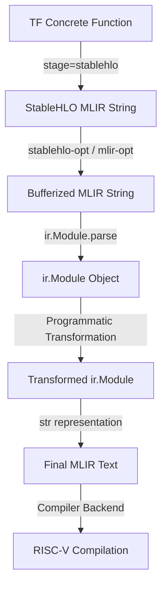

# MLIR Python API 활용 구조적 통합 계획서 (mlir_module_impl_plan.md)

## 1. 개요 (Overview)
본 계획서는 기존의 취약한 문자열 검색 및 정규식 기반 MLIR 변환 방식(`transform_tf_mlir`)을 파이썬 MLIR 바인딩(`mlir.ir.module` API)을 사용하는 구조적 변환 파이프라인으로 전환하기 위한 아키텍처와 상세 설계 및 실행 단계를 제시합니다.

추상 구문 트리(AST) 수준에서 컴파일러 객체를 직접 조작함으로써 구문 오염을 차단하고, 포맷 변화에 무관한 안정적인 프론트엔드-백엔드 연동을 구현하는 것을 목표로 합니다.

---

## 2. 기술적 배경 및 참조 모델

### 2.1 기존 소스 및 문서 분석
* **[0531test.py](file:///c:/Users/MAIN/Desktop/PyTorchSim/Tensorflow/tests/0531test.py) 및 [tensorflow_test.py](file:///c:/Users/MAIN/Desktop/PyTorchSim/Tensorflow/tests/tensorflow_test.py)**: TensorFlow의 concrete function 컴파일 결과를 받아 `ir.Context` 환경 내에서 `ir.Module.parse(mlir_string)`를 통해 구조체 객체로 로드하고, `module.operation` 및 `module.walk()`를 활용하여 파싱에 성공하는 메커니즘을 증명했습니다.
* **[mlirInfo.md](file:///c:/Users/MAIN/Desktop/PyTorchSim/Tensorflow/docs/TensorflowDocs/mlirInfo.md)**: MLIR의 핵심 구조 모델인 `Operation -> Region -> Block -> Operation` 계층을 정의하고, `op.operands`, `op.results`, `op.attributes` 등의 객체 속성 및 Def-Use 체인을 탐색하는 핵심 기법을 명시하고 있습니다.

---

## 3. 구조적 변환 아키텍처 설계 (Transformation Architecture)

문자열 변환기를 대체할 새로운 구조적 컴파일 단계는 다음과 같습니다:



### 3.1 세부 조작 알고리즘 및 API 설계

#### Step 1: 모듈 로드 및 다이얼렉트 허용
`ir.Context`를 초기화하고 등록되지 않은 다이얼렉트 파싱을 활성화합니다.
```python
from mlir import ir
import mlir.dialects.memref as memref
import mlir.dialects.func as func
import mlir.dialects.scf as scf
import mlir.dialects.arith as arith

ctx = ir.Context()
ctx.allow_unregistered_dialects = True
with ctx, ir.Location.unknown():
    module = ir.Module.parse(mlir_string)
```

#### Step 2: 진입 함수 식별 및 시그니처 재정의
모듈 내부에서 진입 함수(보통 `@main`)를 탐색하고 시그니처를 수정합니다.
1. `module.body.operations`를 순회하여 `func.FuncOp`를 찾고 이름을 `kernel`로 변경합니다.
2. 기존 함수의 인자 타입을 추출합니다. 인자 타입이 `MemRefType`인 경우, 형상(Shape) 정보를 조회하여 평탄화된 크기를 도출합니다.
   ```python
   # 예시: 인자의 total_elements 계산
   memref_type = ir.MemRefType(arg.type)
   shape = memref_type.shape
   total_elements = 1
   for s in shape:
       total_elements *= s
   ```
3. 평탄화된 1D MemRef 타입(`memref<total_elementsxf32, layout_strided>`)을 정의하여 새 인자 목록에 추가합니다.
4. 함수 반환 타입(`FunctionType`)을 분석하여 출력 타입과 동일한 평탄화된 1D MemRef를 새 출력용 버퍼 인자(`%arg_tf_out`)로 함수 선언부 매개변수 리스트 마지막에 덧붙입니다. 함수의 리턴 타입은 `void`로 변경합니다.

#### Step 3: 본문 내부 Reinterpret Cast 연산 주입
새로 정의된 1D 평탄화 매개변수들로부터 원래의 다차원 형상을 복원하는 `memref.reinterpret_cast` 연산자들을 프로그램 방식으로 생성하여 함수 진입 블록(`entry_block`)의 처음에 주입합니다.
```python
# Entry Block의 최상단에 빌더 위치 설정
entry_block = func_op.entry_block
builder = ir.InsertionPoint(entry_block.operations[0])

# reinterpret_cast 연산자 생성 및 본문 삽입
# Flat 1D memref -> Original Strided Memref
for old_arg, new_flat_arg in zip(original_args, new_flat_args):
    # API를 사용해 memref.ReinterpretCastOp 빌드
    cast_op = memref.ReinterpretCastOp(
        source=new_flat_arg,
        result_type=old_arg.type,
        offset=0,
        sizes=old_arg.type.shape,
        strides=calculated_strides
    )
    # 기존 본문 내의 old_arg 사용처를 cast_op.result로 일괄 대체(Def-Use 체인 갱신)
    old_arg.replace_all_uses_with(cast_op.result)
```

#### Step 4: 리턴 연산자를 scf.for 복사 루프로 치환
함수의 리턴 지점을 찾아 데이터를 출력 버퍼로 복제해 주고 void 리턴하도록 구조를 수정합니다.
1. `entry_block.operations`를 순회하여 `func.ReturnOp` 연산자를 식별합니다.
2. 리턴하는 변수(예: `%alloc_0`)를 가져오고 `ReturnOp`를 제거합니다.
3. 리턴문이 있던 자리에 중첩 `scf.ForOp`를 빌드하여 루프 변수들을 생성하고, 내부에서 `memref.LoadOp`와 `memref.StoreOp`를 구현하여 데이터를 `%arg_tf_out`으로 복제합니다.
4. 마지막에 인자가 없는 빈 `func.ReturnOp`를 추가하여 안전하게 함수를 종료합니다.

---

## 4. 실행 계획 및 마일스톤 (Milestones)

* **Phase 1: 개발 환경 및 API 프로토타이핑 (1~2일)**
  * Docker 컨테이너 내의 `mlir` 파이썬 패키지 바인딩 API의 세부 기능 유효성 점검.
  * 단일 `scf.for` 및 `memref.reinterpret_cast` 연산자의 파이썬 API 기반 생성 코드 샘플 검증.
* **Phase 2: transform_tf_mlir 리팩토링 (2~3일)**
  * 기존 문자열 파싱 함수를 `MLIRModuleTransformer` 클래스로 완전 교체.
  * 복잡한 Linalg 및 nested scf 루프 연산이 포함된 MLIR 파일 대상 구조 변환 정합성 검증.
* **Phase 3: 통합 테스트 및 에러 복구 모드 구현 (1일)**
  * `test_correctness.py` 내의 8개 테스트 케이스를 새 리액터 하에서 실행하여 완전 통과 보장.
  * 컴파일 에러 발생 시 원래의 MLIR 모듈 구조를 덤프해 주는 디버깅 가시화 패스 구현.
